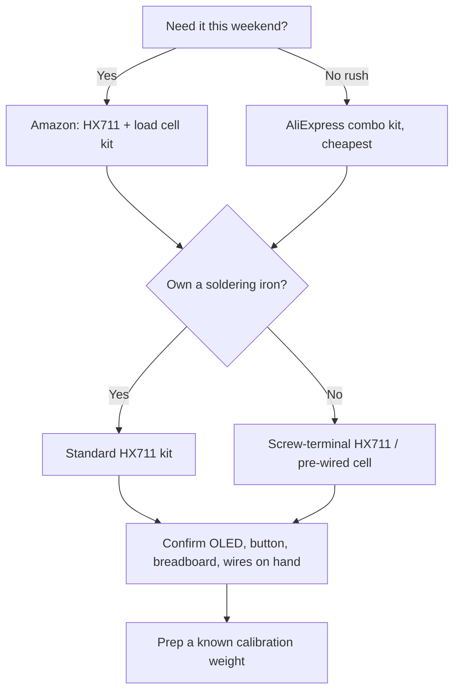

# Buying Guide

## What to buy first (the long pole)

**A 1 kg load cell + an HX711.** These are the only parts you probably don't already have, and they set your timeline because of shipping. Everything else (ESP32, OLED, breadboard, wires, buttons) you likely have or can get same-day.

> **Tip:** buy the load cell and HX711 as a **combo kit** — they're commonly sold together for a few dollars and it saves matching them up.

## No soldering iron? Two ways around it

1. **Pre-wired load cell** — some kits ship with the load cell already terminated, or with a screw-terminal HX711 so you just clamp the four wires. Search "HX711 screw terminal" or "load cell pre-wired."
2. **Borrow/skip** — the only soldering in this whole project is those four load-cell wires. A screw-terminal HX711 removes it entirely.

## Where to buy

| Source | Lead time | Notes |
|--------|-----------|-------|
| **Amazon** | 1–2 days | Most convenient; search "HX711 load cell kit". Slightly pricier but fast — good if you want it this weekend. |
| **AliExpress** | 2–4 weeks | Cheapest by far; too slow for *this* weekend but fine to stock up. |
| Local electronics / maker shops | Same day | Call ahead; load cells are hit-or-miss in stock. |
| DigiKey / Mouser | 1–3 days | Reliable, quality parts; load cells less common than at hobby shops. |

**To build this weekend:** order the load cell + HX711 kit from Amazon now (or grab locally), confirm the rest is on hand.

## What you likely already have

- ESP32
- OLED
- Breadboard, jumpers, USB cable, wall adapter
- 3D printer / MakerWorld access
- Soldering iron (if not, see above)

## Buying decision flow

## Don't overspend

- A basic 1 kg load cell + HX711 kit is **$3–8**. You don't need a precision or industrial cell — ±5 mL accuracy is trivial for any hobby load cell.
- Reuse the ESP32 and OLED you have.
- Total new outlay to build this weekend: realistically **under ~$15** if the OLED is on hand.

## Verify before ordering

- Load cell rating is **1 kg** (not 1 g, not 10 kg)
- HX711 included or bought alongside
- Load cell **screw hole sizes** (so you have matching screws — often M4 + M5)
- USB cable matches your ESP32's port **and** is a data cable
